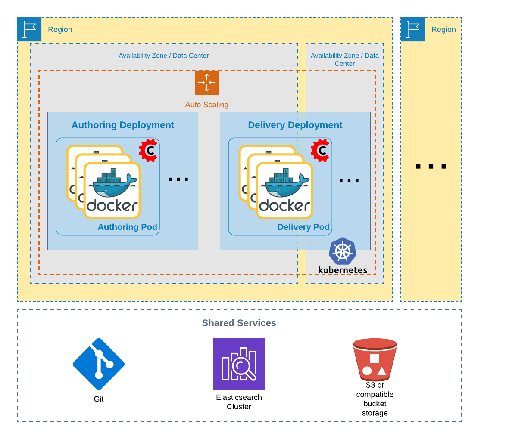

# Terraform craftercms EKS Cluster

A Terraform module to create Crafter CMS compatible Kubernetes clusters.



# 1. Install Client tools

## 1.1 Download terraform

```
wget https://releases.hashicorp.com/terraform/0.12.23/terraform_0.12.23_darwin_amd64.zip
unzip terraform_0.12.23_darwin_amd64.zip
sudo mv terraform /usr/local/bin/terraform
```

## 1.2 Download aws-iam-authenticator

```
curl -o aws-iam-authenticator https://amazon-eks.s3-us-west-2.amazonaws.com/1.14.6/2019-08-22/bin/darwin/amd64/aws-iam-authenticator
chmod +x aws-iam-authenticator
sudo mv ./aws-iam-authenticator /usr/local/bin/aws-iam-authenticator
```

## 1.3 Download helm

```
wget https://get.helm.sh/helm-v3.1.2-darwin-amd64.tar.gz
tar xzvf helm-v3.1.2-darwin-amd64.tar.gz
sudo cp darwin-amd64/helm /usr/local/bin/helm
sudo chmod +x /usr/local/bin/helm
```

## 2. Terraform

Create RDS secrets using AWS Secret Manager:

Valid RDS password: Only printable ASCII characters besides '/', '@', '"', ' '

> content
```
cat > mycreds.json <<EOF
{
   "db_user":"crafter",
   "db_password":"Hvu5#d37**",
}
EOF
```

Store secrets into AWS Secret Manager

```
aws secretsmanager create-secret --name /crafter/test/credentials \
    --description "Crafter credentials" \
    --secret-string file://mycreds.json --region eu-west-2
```

Remove secret file from disk.
```
rm -rf mycreds.json
```

### 2.1 Spin up Crafter EKS environment

Clone github repo

```
git clone https://github.com/shirwahersi/craftercms-eks.git
cd craftercms-eks/terraform
```

```
terraform init
terraform plan
terraform apply
```

### 2.2 Create kubeconfig file:

```
terraform output kubectl_config > ${HOME}/.kube/crafter-eks
export KUBECONFIG=${HOME}/.kube/crafter-eks
```

###  2.3 Verify Cluster

```
kubectl cluster-info

Kubernetes master is running at https://FE0F3397D3C752BCC1D4EF7D60EEC825.yl4.eu-west-2.eks.amazonaws.com
CoreDNS is running at https://FE0F3397D3C752BCC1D4EF7D60EEC825.yl4.eu-west-2.eks.amazonaws.com/api/v1/namespaces/kube-system/services/kube-dns:dns/proxy

To further debug and diagnose cluster problems, use 'kubectl cluster-info dump'.
```

```
kubectl get nodes
NAME                                         STATUS   ROLES    AGE   VERSION
ip-172-16-3-103.eu-west-2.compute.internal   Ready    <none>   13m   v1.14.9-eks-1f0ca9
```

## 3. kubernetes Addons

### 3.1  ALB Ingress Controller on Amazon EKS

The AWS ALB Ingress Controller for Kubernetes is a controller that triggers the creation of an Application Load Balancer (ALB) and the necessary supporting AWS resources whenever an Ingress resource is created on the cluster with the kubernetes.io/ingress.class: alb annotation. The Ingress resource configures the ALB to route HTTP or HTTPS traffic to different pods within the cluster. The ALB Ingress Controller is supported for production workloads running on Amazon EKS clusters.

Add helm incubator repository
```
helm repo add incubator http://storage.googleapis.com/kubernetes-charts-incubator
```

Install ALB ingress controller
```
helm install alb-ingress-controller \
  --set autoDiscoverAwsRegion=true \
  --set autoDiscoverAwsVpcID=true \
  --set clusterName=staging-craftercms-eks-cluster \
  --set rbac.serviceAccountAnnotations."eks\.amazonaws\.com/role-arn=arn:aws:iam::414336264239:role/ALBIngressControllerIAMRole" \
  --namespace kube-system \
  incubator/aws-alb-ingress-controller
```

Verify that the deployment was successful and the controller started:


```
kubectl logs -n kube-system $(kubectl get po -n kube-system | egrep -o alb-ingress[a-zA-Z0-9-]+)
```

### 3.2 Install external-dns

ExternalDNS synchronizes exposed Kubernetes Services and Ingresses with Route53 DNS.


```
helm install external-dns \
  --set provider=aws \
  --set aws.zoneType=public \
  --set txtOwnerId=external-dns \
  --set domainFilters[0]=shirwalab.com \
  --set policy=sync \
  --set rbac.serviceAccountAnnotations."eks\.amazonaws\.com/role-arn=arn:aws:iam::414336264239:role/ExternalDnsIAMRole" \
  --namespace kube-system \
  stable/external-dns
```

## 4. Deploy CrafterCMS

### 4.1 Create the SSH Keys Secret

The Delivery Pod will need SSH access to the Authoring Pod to pull the site content. For this, you need to generate an SSH public/private key pair for authentication and provide the key pair as a Kubernetes Secret to the Pods:

```
mkdir ssh-secrets
ssh-keygen -m PEM -b 4096 -t rsa -C "crafter@example.com" -f ssh-secrets/id_rsa
cp ssh-secrets/id_rsa.pub ssh-secrets/authorized_keys

cat > ssh-secrets/config <<EOF
Host authoring-ssh-service
    StrictHostKeyChecking no
EOF
```

Create Secret ssh-keys with the files just generated:

```
kubectl create secret generic ssh-keys \
--from-file=ssh-secrets/authorized_keys \
--from-file=ssh-secrets/id_rsa \
--from-file=ssh-secrets/id_rsa.pub \
--from-file=ssh-secrets/config
```

Delete ssh-secrets directory

```
rm -rf ssh-secrets/
```

Create Database credentials secret

```
kubectl create secret generic crafter-secrets \
--from-literal=MARIADB_USER=$(aws secretsmanager get-secret-value --secret-id /crafter/test/credentials | jq --raw-output '.SecretString' | jq -r .db_user) \
--from-literal=MARIADB_PASSWD=$(aws secretsmanager get-secret-value --secret-id /crafter/test/credentials | jq --raw-output '.SecretString' | jq -r .db_password)
```

Create ConfigMap containing RDS and Elasticsearch endpoint url

```
kubectl create configmap crafter-config \
--from-literal=MARIADB_HOST=$(terraform output rds_endpoint) \
--from-literal=ES_URL=https://$(terraform output es_endpoint) \
--from-literal=ES_PORT=443
```

### 4.2 Deploy Authoring

```
cd ../k8s-manifests
kubectl apply -f authoring/
```

### 4.3 Deploy Delivery

```
kubectl apply -f delivery/
```

```
kubectl get pods
NAME                                    READY   STATUS    RESTARTS   AGE
authoring-deployment-6cccf489d4-6k8jv   3/3     Running   0          56m
delivery-deployment-577bdd4fc7-8jkfc    2/2     Running   0          41m
```
